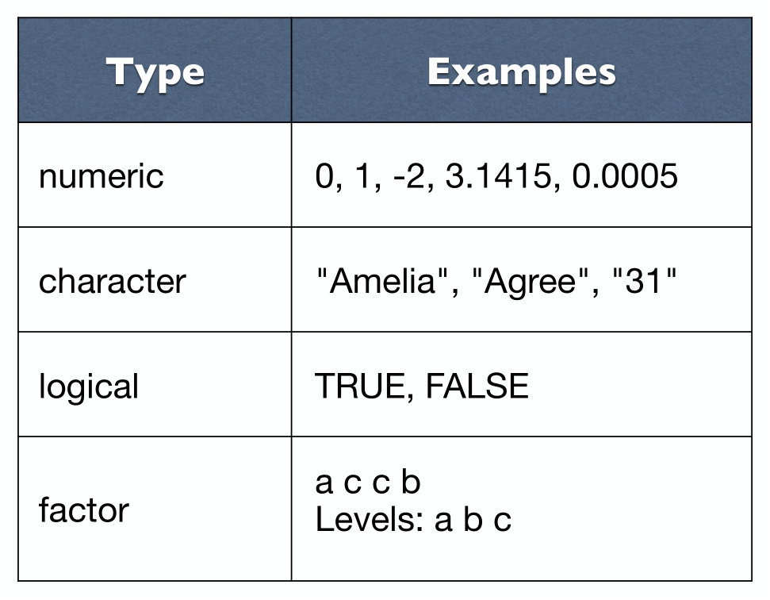
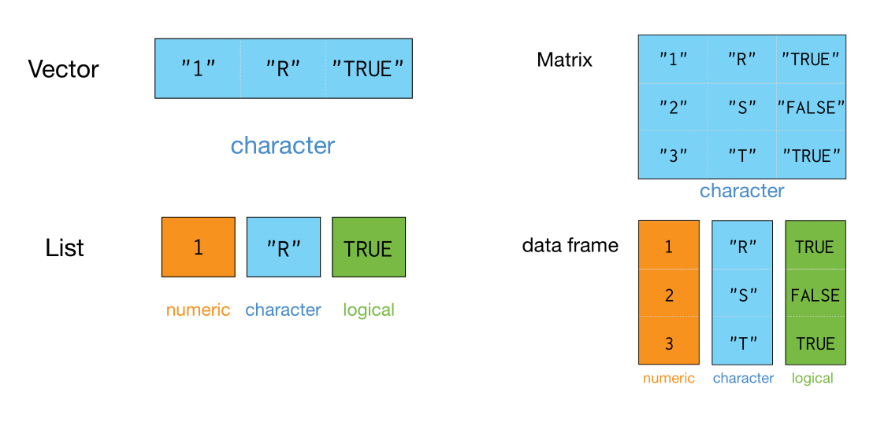

## 数据类型


```{r out.width = '100%', echo = FALSE}

```

- 数值型
```{r}
3
5000
3e+06
class(0.0001)
```

- 字符串型
```{r}
"hello"
"girl"
"1"     # 1 vs "1"
class("1")
```

```{r}
class("1")
```

- 逻辑型
```{r}
TRUE
FALSE
3 < 4
```


```{r}
class(T)
```


```{r}
3 < 4
```

- 因子型
```{r}
fac <- factor(c("a", "b", "b", "c"))
fac
```


```{r}
class(fac)
```


## 数据结构

```{r out.width = '100%', echo = FALSE}

```

- 向量
```{r}
vec <- c(1, 2, 3, 10, 100)  # c function (for "combine" or "concatenate").
vec
```  


- 矩阵
```{r}
mat <- matrix(1:9, ncol = 3, byrow = T)
mat
```

- 列表
```{r}
lst <- list("R", 1:9, TRUE)
lst
```

- 数据框
```{r}
df <- data.frame(
	num = c(1, 2, 3),
	chr = c("R", "S", "T"),
	lgl = c(TRUE, FALSE, TRUE)
)
df
```


