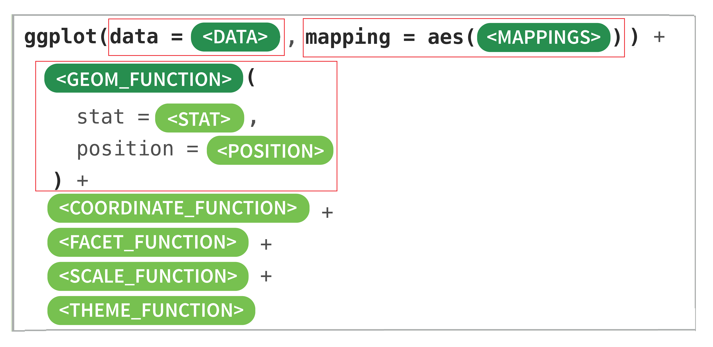

# 复习

## "The Grammar of Graphics": 

> You provide the data, tell 'ggplot2' how to map variables to aesthetics, what graphical primitives to use, and it takes care of the details.


```{r, out.width = '70%', echo = FALSE}

```


1. `data`: 数据框data.frame (注意，不支持向量vector和列表list类型）


2. `geoms`: 几何图形，确定我们想画什么样的图，一个`geom_***`确定一种图形。比如
    - `geom_point()` 画点图
    - `geom_line()`  画折线图
    - `geom_smooth()`画平滑曲线

    
3. `aes`: 数据框中的数据变量**映射**到图形属性。
   - 什么叫图形属性？就是图中点的位置、形状，大小，颜色等眼睛能看到的东西。常见图形属性包括：
    + x（x轴方向的位置）
    + y（y轴方向的位置）
    + color（点或者线等元素的颜色）
    + size（点或者线等元素的大小）
    + shape（点或者线等元素的形状）
    + alpha（点或者线等元素的透明度）
    
   - 什么叫映射？就是一种对应关系，一个图形属性对应着数据框的一列。比如sex变量（有`female`和`male`两组）映射到颜色，那么`female`对应一种颜色，而`male`对应成另一种颜色。 数值上的`female`和`male`两种字符，映射成图形上的两种颜色。
     
    


## 数据类型

```{block}
前面讲到R语言数据类型，有字符串型、数值型、因子型、逻辑型、日期型等，ggplot2会将字符串型、因子型、逻辑型、日期型默认为**离散变量**，而数值型默认为**连续变量**。我们在而呈现数据的时候，可能会同时用到多种类型的数据，比如

* 一个离散
* 一个连续

* 两个离散
* 两个连续
* 一个离散, 一个连续

* 三个连续

```


# 开始

还是用企鹅数据

```{r, message=FALSE, warning=FALSE}
library(tidyverse)
penguins <- read_csv("./demo_data/penguins.csv") 
penguins
```


```{block}
接下来，我们需要思考应该选择什么样的图形，回答数据问题。
```


## 每个种类有多少企鹅

统计每个种类企鹅的数量，然后画出来

按照常规的思路，我们一般会先统计，然后喂给ggplot，
```{r}
penguins %>% 
  count(species) %>% 
  
  ggplot(aes(x = species, y = n)) +
  geom_point()
```


这种情形，常用柱状图，因此可以选择`geom_col()`这种几何图形

```{r}
penguins %>% 
  count(species) %>% 
  ggplot(aes(x = species, y = n)) +
  geom_col()
```


是好图吗？怎么改进？

- 排序 
- 翻转 
- 配色


```{block}
色彩是一种很强的刺激（信息），一般会有三种作用：分组，强调，量化。如果你的图不想表达这三种意思，那图中尽可能的不要用太多色彩
```


## 嘴峰长度的分布

嘴峰长度是连续变量，可以用直方图或者密度图
```{r}
penguins %>% 
    ggplot(aes(x = bill_length_mm)) +
    geom_histogram() 
```


```{r}
penguins %>% 
    ggplot(aes(x = bill_length_mm)) +
    geom_density()
```

为什么是两个峰？如何探究背后的原因？种类不同导致的？性别不同导致的？还是所在岛屿不同导致的？


## 不同种类，嘴峰长度分布

这里一个是离散变量，一个是连续变量。可以选择不同的几何图形来呈现


### 散点图
```{r}
penguins %>% 
    ggplot(aes(x = species, y = bill_length_mm)) +
    geom_point()
```


### 抖散图
点重叠的处理方案

```{r}
penguins %>% 
    ggplot(aes(x = species, y = bill_length_mm)) +
    geom_jitter()
```


### 箱线图
可以用箱线图（箱线图可以显示分布的中位数、分位数等）

```{r}
penguins %>% 
    ggplot(aes(x = species, y = bill_length_mm)) +
    geom_boxplot() +
    geom_jitter() 
```

```{r}
penguins %>% 
    ggplot(aes(x = fct_reorder(species, bill_length_mm, median), 
               y = bill_length_mm)
           ) +
    geom_boxplot() +
    geom_jitter() 
```


### 小提琴图
```{r}
penguins %>% 
    ggplot(aes(x = species, y = bill_length_mm)) +
    geom_violin(fill = "grey90")  +
    geom_jitter() 
```


### 山峦图
```{r}
library(ggridges)
penguins %>%
  ggplot(aes(y = species, x = bill_length_mm, fill = species)) +
  ggridges::geom_density_ridges(alpha = 0.5)
```


## 嘴峰长度和嘴峰厚度之间的关系

两个连续变量，最常用的是散点图

```{r}
penguins %>% 
    ggplot(aes(x = bill_length_mm, y = bill_depth_mm)) +
    geom_point() +
    geom_smooth(method = "lm")
```

怎么改进这个图？


## 分组

ggplot2实现分组的方法很多，通常情况下，是把一个**离散变量**映射到以下**图形属性**

- `color`
- `fill`
- `alpha`
- `shape`
- `size`
- `linetype`


```{r}
penguins %>% 
  ggplot(aes(x = bill_length_mm, y = bill_depth_mm)) +
  geom_point(aes(color = species)) 
```


```{r}
penguins %>% 
  ggplot(aes(x = bill_length_mm, y = bill_depth_mm)) +
  geom_point(aes(shape = species)) 
```


```{r}
penguins %>% 
  ggplot(aes(x = bill_length_mm, y = bill_depth_mm)) +
  geom_point(aes(alpha = species)) 
```


还有一种分组方法，就是**分面**
```{r}
penguins %>% 
  ggplot(aes(x = bill_length_mm, y = bill_depth_mm)) +
  geom_point() +
  facet_wrap(vars(species))
```

还可以弄得更漂亮点吗？

```{r}
penguins %>% 
  ggplot(aes(x = bill_length_mm, y = bill_depth_mm)) +
  geom_point(data = penguins %>% select(-species), color = "gray80") +
  geom_point(aes(color = species)) +
  facet_wrap(vars(species))
```


## 图层叠加

以下是不同性别的企鹅体重，希望在图中显示出**均值的位置**
```{r}
penguins %>%
  ggplot(aes(x = sex, y = body_mass_g)) +
  geom_jitter()
```


```{r}
m <- penguins %>%
  group_by(sex) %>%
  summarise(
    mean = mean(body_mass_g)
  )
m
```


```{r}
penguins %>%
  ggplot(aes(x = sex, y = body_mass_g)) +
  geom_jitter() +
  geom_point(data = m, aes(y = mean), color = "red", size = 5) 
```


## 添加文本标签

如何在点的位置**添加**具体数值文本？


```{r}
penguins %>%
  ggplot(aes(x = sex, y = body_mass_g)) +
  geom_jitter() +
  geom_point(
    data = m, aes(y = mean), size = 5, color = "red"
  ) +
  geom_text(data = m, 
            aes(x = sex, y = mean, label = round(mean, 2)), 
            color = "red", vjust = -1)
```


## 椭圆图

```{r}
penguins %>%
  ggplot(aes(x = bill_length_mm, y = bill_depth_mm)) +
  geom_point() +
  geom_path(stat = "ellipse")
```

每个物种想有各自的椭圆图？


# 总结

- `geom_point()`
- `geom_smooth`
- `geom_col()`
- `geom_histogram()`
- `geom_density()`
- `geom_jitter()`
- `geom_boxplot()`
- `geom_violin()`
- `geom_text()`
- `ggridges::geom_density_ridges()`
- `geom_path()`
- `facet_wrap()`
- `fct_reorder()`


> 用 ggplot2 画图，有种恋爱的感觉: "你懂我的图谋不轨，我懂你的故作矜持"。


